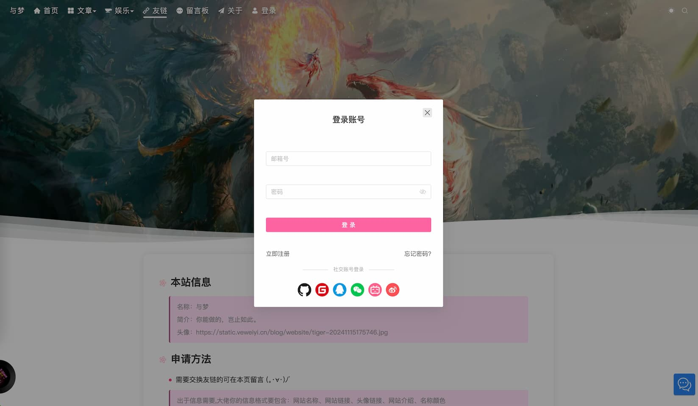
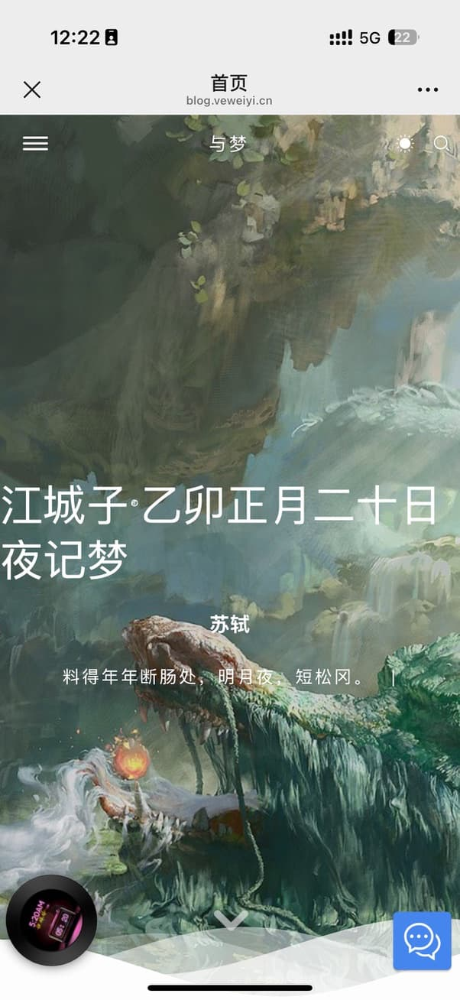
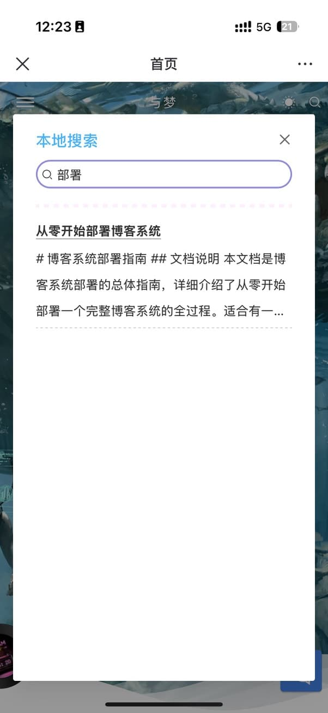
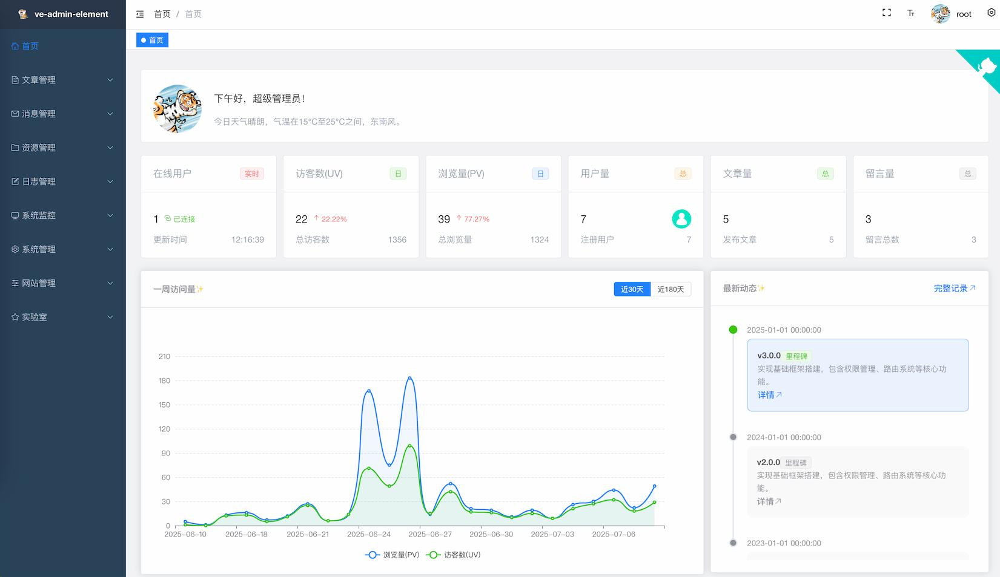
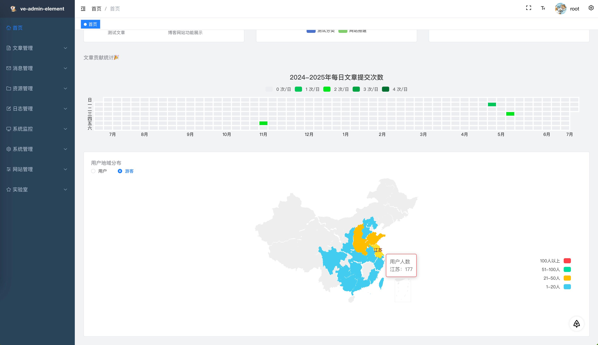
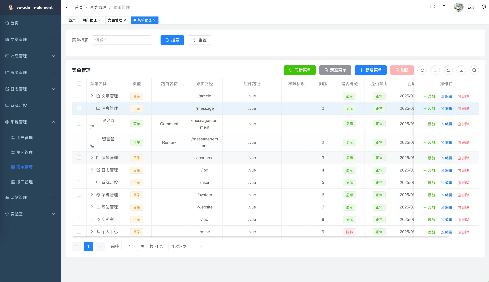

<div align=center>

# blog

现代化的全栈博客系统 —— Go 微服务后端 + Vue 3 双前端

[](https://go.dev/)
[](https://go-zero.dev/)
[](https://grpc.io/)
[](https://gorm.io/)
[](https://www.mysql.com/)
[](https://redis.io/)
[](https://vuejs.org/)
[](https://www.typescriptlang.org/)
[](https://www.docker.com/)
[](https://opensource.org/licenses/MIT)

[🖥️ 博客前台](https://app.veweiyi.cn) ·
[🖥️ 管理后台](https://admin.veweiyi.cn) ·
[📑 前台接口文档](https://app.veweiyi.cn/api/v1/swagger/index.html) ·
[📑 后台接口文档](https://admin.veweiyi.cn/admin-api/v1/swagger/index.html)

</div>

---

## 📚 项目简介

blog 是一个基于 Go 语言开发的现代化博客系统，采用微服务架构。后端基于 go-zero 框架，通过 gRPC 提供服务、HTTP 网关对外暴露接口；前端包含博客前台与管理后台两个独立的 Vue 3 单页应用。

项目采用 **monorepo + git submodule** 组织：主仓库负责协议定义、部署编排与文档，各服务是独立的 git 仓库，拥有各自独立的依赖管理与发布节奏。

### ✨ 核心特性

- **微服务架构** —— go-zero + gRPC，服务注册发现、负载均衡、高可用
- **双前端** —— 博客前台（Naive UI）与管理后台（Element Plus）独立开发部署
- **完整权限体系** —— 基于 RBAC 的动态权限、菜单与路由
- **多种登录方式** —— 账号密码、GitHub / QQ / 微信 / Google / 微博 OAuth
- **实时通信** —— STOMP over WebSocket 聊天室与消息推送
- **异步解耦** —— RabbitMQ 消息队列处理通知、日志等异步任务
- **三种部署形态** —— Kubernetes、Docker 单机（生产 / 开发·自建），共用同一套镜像命名；选型见 [`deploy/README.md`](./deploy/README.md)
- **代码生成** —— 内置 goctl 模板与 goctlx 工具，从 API 定义与数据库生成代码

---

## 🏗️ 系统架构

```
┌──────────────────────────────────────────────────────────────┐
│                           客户端层                           │
│     博客前台 (blog-app)           管理后台 (blog-admin)      │
└───────────────────────────┬──────────────────────────────────┘
                            │ HTTP
┌───────────────────────────▼──────────────────────────────────┐
│                         HTTP 网关层                          │
│      app-api (:9420)                admin-api (:9421)        │
│                    handler → logic → svc                     │
└───────────────────────────┬──────────────────────────────────┘
                            │ gRPC
┌───────────────────────────▼──────────────────────────────────┐
│                          RPC 服务层                          │
│                       blog-rpc (:9120)                       │
│         用户 / 访客 / 认证 / 访问控制 / 内容 / 媒体          │
│           讨论 / 聊天 / 站点 / 通知 / 日志 / 统计            │
└───────────────────────────┬──────────────────────────────────┘
                            │
┌───────────────────────────▼──────────────────────────────────┐
│                           基础设施                           │
│ MySQL · Redis · RabbitMQ · Nacos 注册中心 · STOMP WebSocket  │
└──────────────────────────────────────────────────────────────┘
```

### 📁 仓库结构

```
blog/
├── Makefile          # 一键脚本：初始化、依赖、起停服务
├── blog-cloud/       # 后端服务：api/admin、api/app、rpc/blog
├── blog-admin/       # 管理后台前端（Vue 3 + Element Plus）
├── blog-app/         # 博客前台前端（Vue 3 + Naive UI）
├── vkit/             # 公共库：adapter（外部服务适配）、infra（框架封装）、x（通用能力）
├── stompws/          # STOMP over WebSocket 服务
├── goctlx/           # 代码生成工具（API / 模型 / 前端）
├── protocol/         # 协议定义：api、proto
├── deploy/           # 部署编排：docker、docker-compose、k8s
├── docs/             # 文档：设计、功能方案、审查、手册、规范
└── assets/           # 项目截图
```

---

## 📸 图片展示

### 博客前台

PC 端首页 —— 全屏大图轮播、诗词文案、音乐播放器：


文章列表 —— 卡片式布局、分类标签、站点资讯侧栏：


登录 —— 邮箱密码登录，支持多种社交账号：



移动端 —— 响应式布局，抽屉式导航与本地搜索：

| 首页 | 导航菜单 | 搜索 |
|:---:|:---:|:---:|
|  |  |  |

### 管理后台

仪表盘 —— 在线用户、UV / PV、文章量等实时统计与访问趋势：



数据统计 —— 文章贡献热力图与用户地域分布：



菜单管理 —— 动态菜单配置，与 RBAC 权限体系联动：



---

## 🛠️ 技术栈

> 版本以各模块 `go.mod` / `package.json` 为唯一真相源，本表仅为概览。

### 后端

| 技术 | 版本 | 说明 |
|------|------|------|
| Go | 1.26 | 编程语言 |
| go-zero | 1.10 | 微服务框架 |
| gRPC | 1.84 | RPC 通信框架 |
| GORM | 1.31 | ORM 框架 |
| MySQL | 8.0 | 关系型数据库 |
| Redis | 7.4 | 缓存数据库（服务端 `redis:7.4-alpine`，客户端 go-redis v9.22） |
| RabbitMQ | 4.3 | 消息队列 |
| Nacos | 3.1 | 注册中心与配置中心 |
| JWT | — | 身份认证 |
| Swagger | 2.0 | API 文档 |

### 前端

| 技术 | 博客前台 | 管理后台 |
|------|---------|---------|
| Vue | 3.5 | 3.5 |
| TypeScript | 5.9 | 5.9 |
| Vite | 8.3 | 8.0 |
| Pinia | 4.0 | 3.0 |
| UI 组件库 | Naive UI 2.45 | Element Plus 2.14 |
| UnoCSS | 66.10 | 66.7 |

### 部署

Docker · Docker Compose · Kubernetes · Nginx

---

## 📁 子项目导航

| 项目 | 说明 | 仓库 |
|------|------|------|
| [blog-cloud](./blog-cloud) | 后端服务（go-zero 微服务版） | [GitHub](https://github.com/ve-weiyi/blog-cloud) |
| [blog-admin](./blog-admin) | 管理后台前端 | [GitHub](https://github.com/ve-weiyi/blog-admin) |
| [blog-app](./blog-app) | 博客前台前端 | [GitHub](https://github.com/ve-weiyi/blog-app) |
| [vkit](./vkit) | 公共库（适配器与工具集） | [GitHub](https://github.com/ve-weiyi/vkit) |
| [stompws](./stompws) | STOMP over WebSocket 服务 | [GitHub](https://github.com/ve-weiyi/stompws) |
| [goctlx](./goctlx) | 代码生成工具 | [GitHub](https://github.com/ve-weiyi/goctlx) |

---

## 🚀 快速开始

### 环境要求

- Go 1.26+（工作区 `go.work` 声明 1.26.1；各模块 `go.mod` 同，`stompws` 为 1.24.0）
- Node.js 20.19+ / 22.12+ 与 pnpm
- Docker 与 Docker Compose
- MySQL 8.0+ · Redis 7.4+ · RabbitMQ 4.3+

### 1. 克隆项目

```bash
git clone --recursive git@github.com:ve-weiyi/blog.git
cd blog
make install    # 后端 go mod tidy + 前端 pnpm install
```

已克隆但未拉取子模块时：

```bash
make init       # 等价于 git submodule update --init --recursive
```

### 2. 启动依赖服务

```bash
docker compose -f deploy/docker-compose/mysql/mysql.yaml up -d
docker compose -f deploy/docker-compose/redis/redis.yaml up -d
docker compose -f deploy/docker-compose/rabbitmq/rabbitmq.yaml up -d
docker compose -f deploy/docker-compose/nacos/nacos.yaml up -d
```

### 3. 启动后端

```bash
make backend    # rpc → admin-api → app-api 依次拉起，日志写入 logs/
```

手工逐个启动（等价）：

```bash
cd blog-cloud
go run rpc/blog/blog.go   -f rpc/blog/etc/blog-rpc.yaml
go run api/app/app.go     -f api/app/etc/app-api.yaml
go run api/admin/admin.go -f api/admin/etc/admin-api.yaml
```

> `etc/*.yaml` 是本地配置，被 `.gitignore` 忽略（仓库只跟踪 `.example.yaml`）。
> 首次需从 example 复制：`cp rpc/blog/etc/blog-rpc.example.yaml rpc/blog/etc/blog-rpc.yaml`。

### 4. 启动前端

```bash
make dev    # 两个前端一起起（mock 模式，不需要后端）
```

前端有三种模式，按接口来源区分：

| 命令 | 接口来源 | 需要后端 | 用途 |
|------|---------|:-------:|------|
| `pnpm dev` | mock | 否 | 纯前端开发 |
| `pnpm test` | 本地后端 `:9420` / `:9421` | 是 | 前后端联调 |
| `pnpm preview` | 构建产物 + mock | 否 | 预览打包结果 |

> `pnpm preview` 的 mock 由 `vite preview` 的服务端中间件承接，只在本地生效；
> 构建产物直接托管到 nginx 不会带 mock。

### 5. 一键容器化部署

```bash
docker compose -f deploy/docker/docker-compose.yml up -d
```

部署形态选型见 [`deploy/README.md`](./deploy/README.md)：Kubernetes 走 [`deploy/k8s/`](./deploy/k8s)，
Docker 单机走 [`deploy/docker/`](./deploy/docker) 与 [`deploy/docker-compose/`](./deploy/docker-compose)。

### 命令速查

根目录 Makefile 收敛了日常操作：

| 命令 | 说明 |
|------|------|
| `make init` | 首次初始化全部子模块 |
| `make fetch` | 更新主仓库 + 全部子模块到最新 |
| `make install` | 后端 `go mod tidy` + 前端 `pnpm install` |
| `make dev` | 前端 mock 模式（不起后端） |
| `make test` | 后端按 Nacos 配置起 + 前端连本地后端 |
| `make preview` | 前端构建产物 + mock |
| `make backend` | 仅后端，按本地 yaml 起 |
| `make frontend` | 仅前端，mock 模式 |
| `make stop` | 停止前后端运行的端口 |
| `make clean` | 清理 `logs/` |

---

## 📈 后续计划

- [x] 使用 STOMP 协议 + WebSocket 实现聊天室
- [ ] 用户评论邮件提醒
- [ ] 集成 ElasticSearch 搜索引擎
- [ ] 添加 Prometheus 监控
- [ ] 集成 AI 聊天功能
- [ ] 增加更多社交功能

---

## 🤝 参与贡献

欢迎提交 Issue 与 Pull Request。分支管理与提交规范见 [`docs/standards/`](./docs/standards)。

## 📄 开源协议

本项目基于 [MIT](https://opensource.org/licenses/MIT) 协议开源。

## 🙏 致谢

感谢以下项目的启发：

- [风丶宇的博客](https://github.com/X1192176811/blog)
- [阿冬的个人博客](https://github.com/ttkican/Blog)
- [vue3-element-admin](https://github.com/youlaitech/vue3-element-admin)
